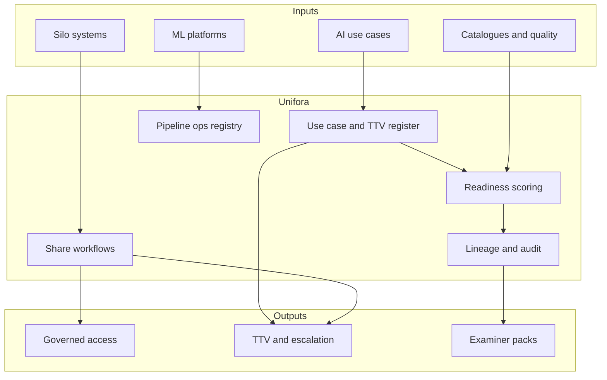

# Unifora

**Source:** `ai-in-financial/the-ai-revolution-finextra-v2-paper/`
**Domain:** `ai-fin`
**One-liner:** An ai-readiness data unification ops play that removes silo barriers, federates analytics for risk/governance, and operationalises model pipelines so financial institutions can hit quarter-scale time-to-value on AI use cases instead of spending 80% of project time collecting data.
**Wedge:** Chief Data Officers and AI programme leads at banks and capital-markets firms that have approved AI use cases (AML false-positive reduction, virtual agents, desk augmentation, post-trade RPA+AI) but stall on siloed data estates and political ownership of databases.
**Positioning:** Finextra AI revolution ops play—data-structure transformation checklist as product. The Finextra/Intel paper’s core claim is not “buy more models”; it is that AI ROI and regulatory compliance both require unified, governable data infrastructures, with Bank of America cited seeking time-to-value within one quarter. Unifora productises that checklist and operating rhythm.

## Market research synthesis

### Thesis from source

*The AI Revolution: Time to Get Ready* (Finextra with Intel, May 2018) surveys AI entering FS across algorithmic trading, fraud, advice, settlement, customer interaction, RegTech/SupTech (FSB November 2017: promise if risks managed). Business cases include Bradesco’s virtual agent (>85% satisfaction; 94% queries handled by agent), Mizuho’s Pepper greeter, Société Générale Markets recommendation and contract-clause ML plus ChatParser for RFQs, Celent’s post-trade RPA/AI inroads (KYC, AML, surveillance, research NLG). Regulatory pressure—MiFID, EMIR, PSD2, GDPR, AML/ATF/sanctions—collides with siloed unstructured collections and costly false positives; one large bank example cites ML cutting payment false positives ~85% and >$17M underwriting cost reduction while scoring up to 5,000 transactions/second.

The strategic hinge is section 04–05: getting value from AI and meeting obligations share a prerequisite—enterprise architecture for interoperability across decentralised lines of business. Aite: every decision scrutinised; lineage and quality audit trails required; bad data is fatal to digital labour. Pitfalls of non-unified structures: weak compliance analytics and weak ability to invent client services under open banking (Deloitte on PSD2 commoditisation threat vs personalisation opportunity). Political reality: silos as fiefdoms. Peiravi (Intel): AI only as strong as underpinning data; accuracy, secure capture/storage, and accessibility matter more than volume myth.

Checklist productised by Unifora: (1) remove silos—large banks may have thousands of databases; collection/prep can be 80% of AI project time; (2) create data & analytics platform for risk governance and secure third-party sharing; (3) operationalise advanced analytics enterprise-wide—continuous flow, cleansing/prep, data scientists maintaining hundreds of algos across concurrent AI projects like IT infrastructure (patch, update, redesign). Culture: senior sponsorship, fail-fast, agile experimentation—but Unifora’s shippable wedge is the data unification and AI pipeline ops control plane with quarter TTV gates.

### Buyer & economic model

- **Primary buyer:** Chief Data Officer or Head of AI/Analytics Transformation co-sponsored by CIO.
- **Users:** data product owners, domain data stewards, AI project leads, model ops engineers, risk/compliance data officers, LOB CIOs resisting/participating in federated sharing, security architects.
- **Budget owner / value metric:** data platform and AI programme budget. Metrics: median % of AI project time spent on data wrangling (target down from ~80%); days to first governed dataset for an approved use case; quarter TTV hit rate; lineage coverage for regulatory extracts; production algo pipeline SLAs.
- **Competing status quo:** per-project data pulls; lake-without-stewards; model notebooks without ops; compliance data marts rebuilt per regulation; LOB veto by neglect.

### Domain constraints

- **Regulatory / trust / safety:** GDPR/PII, GDPR vs PSD2 sharing tension, AML evidence lineage, outsourcing/cloud confidentiality (DTCC warning cited), operational resilience of federated platforms.
- **Data sensitivity:** customer PII, trading data, SAR-relevant features; third-party sharing under controlled scenarios only.
- **Change-management realities:** LOB fiefdoms; Unifora must combine executive mandate workflows with steward incentives and measurable TTV—not a pure central confiscation narrative.

## Business requirements

- BR-1: Every approved AI use case must link to governed datasets with named stewards before build effort counts as “in progress.”
- BR-2: Data wrangling effort share per use case must be measured; programmes must target reduction from the source’s ~80% prep tax.
- BR-3: Lineage and quality evidence must be exportable for regulatory and client transparency demands.
- BR-4: Cross-LOB sharing requests must run a governed workflow (approve/deny with purpose); silent bilateral extracts are non-compliant.
- BR-5: Third-party / open-banking sharing must enforce consent and minimisation scenarios separately from internal federation.
- BR-6: AI pipelines (train, validate, deploy, monitor, patch) must be operationalised with owners and SLAs akin to infrastructure services.
- BR-7: Time-to-value gates (e.g. one-quarter target) must be declared per use case with executive visibility on misses.
- BR-8: Security and resiliency controls for the analytics platform must be attested; cloud use requires explicit ownership of data protection remaining with the institution.
- BR-9: Political silo disputes must escalate to a named executive forum with deadlines—unresolved blocks cannot linger without status.
- BR-10: Concurrent AI projects must not silently contend for the same uncleansed sources without a capacity plan.
- BR-11: Audit exports must show dataset access, sharing decisions, and pipeline changes for examiners.
- BR-12: Unifora orchestrates data readiness and pipeline ops; model training frameworks and channel UIs remain separate systems.

## User stories

Canonical user stories live in sibling [USER_STORIES.md](USER_STORIES.md).

## System design

### Overview

Unifora registers AI use cases, maps required data products, runs silo-removal and sharing workflows, tracks readiness and TTV gates, operationalises analytics pipelines, and exports lineage/audit evidence. It integrates with catalogues, quality tools, and ML platforms without replacing them.

### Actors & boundaries

- **Actors:** CDO office, stewards, AI leads, model ops, compliance, LOB CIOs, executive escalation forum, external TPPs (mediated).
- **Trust boundary:** purpose-limited access; third parties never see raw internal federation graphs beyond approved products.
- **Human-in-the-loop points:** share approve/deny; escalation rulings; TTV miss remediation; pipeline production approval.

### Core capabilities

1. **AI use-case register** with TTV gates.
2. **Data product catalogue** and steward assignments.
3. **Silo discovery and removal plans**.
4. **Governed share workflows** — internal and third-party.
5. **Lineage and quality evidence**.
6. **Readiness scoring** against the Finextra checklist.
7. **Pipeline ops registry** — SLAs, patches, owners.
8. **Capacity planning** across concurrent projects.
9. **Executive escalation** for silo disputes.
10. **Audit and regulatory export**.

### Conceptual data

- **Primary entities:** UseCase, TTVGate, DataProduct, Steward, SiloSystem, ShareRequest, ShareDecision, LineageGraph, QualityRule, ReadinessScore, Pipeline, PipelineSLA, CapacityPlan, EscalationCase, AuditExport.
- **Critical events:** use case filed, data mapped, share approved/denied, readiness scored, TTV hit/missed, pipeline deployed, SLA breached, escalation resolved, audit exported.
- **Retention / audit needs:** share decisions and lineage snapshots retained for regulatory lookback; access logs retained per security policy.

### Integrations (conceptual)

- **Systems of record:** data catalogue, quality tools, IAM, ML/feature platforms, GRC, open-banking consent stores.
- **Upstream signals:** schema scans, quality incidents, pipeline metrics, use-case KPI actuals.
- **Downstream actions:** access grants, escalation tasks, TTV miss reports to exco, examiner packs.

### High-level architecture

### Success metrics

- **Leading:** readiness score distribution; share-request cycle time; wrangling-time share; lineage coverage %; pipeline SLA attainment.
- **Lagging:** quarter TTV hit rate; reduction in prep tax toward well below 80%; AML/regulatory rework hours; concurrent project thrash incidents; examiner findings on data governance.

## OpenAPI skeleton

Canonical HTTP surface lives in sibling [openapi.yaml](openapi.yaml). Summary:

- **Base path:** `/v1/...`
- **Auth:** Bearer JWT for data/AI operators; `X-API-Key` for catalogue/pipeline connectors.
- **Resource groups:** UseCases, DataProducts, Shares, Readiness, Pipelines, Escalations, Lineage, Audits.
