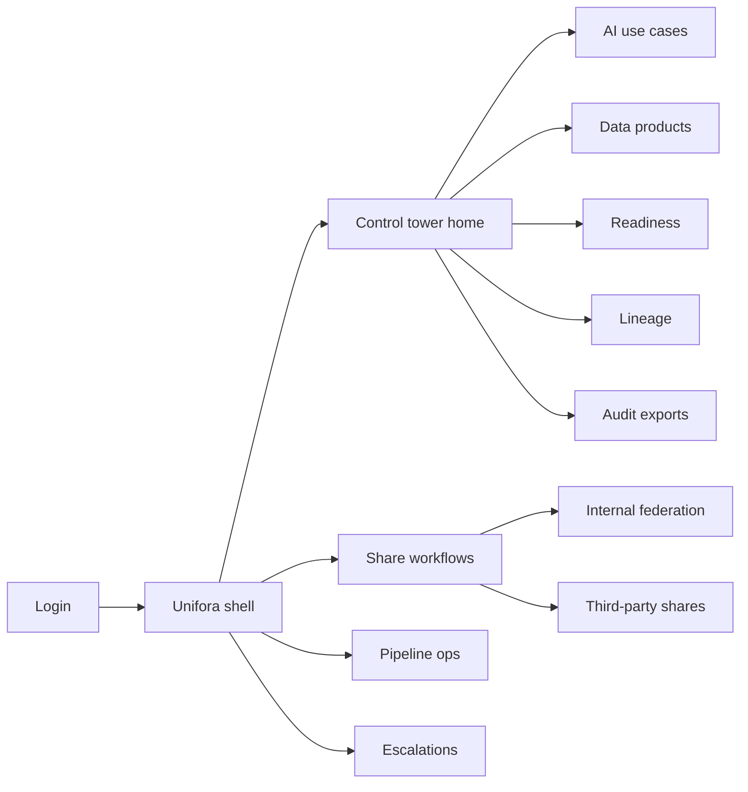
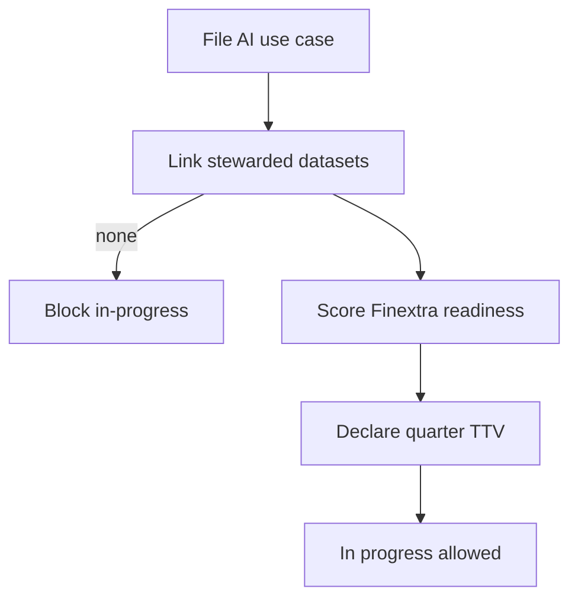

# Unifora — Web app

**Product:** [PRODUCT.md](./PRODUCT.md)
**Primary surface:** ai-readiness data unification ops console (CDO / steward / AI lead / model ops / LOB CIO workspaces)
**Secondary surfaces:** Executive TTV & escalation forum view; examiner lineage/audit pack viewer
**Design thesis:** Unifora is a control tower for the Finextra checklist — the UI metaphor is a yardmaster board for data products and pipelines, not a lake marketing dashboard. Visual language is signal-orange on graphite industrial panels: wrangling-tax meters feel like load gauges; share decisions feel switch-thrown; TTV misses feel like red schedule slips. The Unifora wordmark sits as a quiet yard stamp on every readiness and share screen so LOBs know whose governed federation they are joining—not a silent confiscation.

## UX research synthesis

### Category peers (best-in-class)

- **Collibra / Alation data intelligence:** Steward-owned products, lineage, and policy-aware sharing. Steal: purpose-bound share requests and steward accountability; reject catalogue-only browsing without AI use-case TTV gates.
- **Databricks Unity Catalog / Snowflake governance UX:** Cross-domain access with auditability. Steal: governed grants and usage visibility for LOB CIOs; reject notebook-first as the home for executives.
- **MLflow / SageMaker Model Registry ops:** Pipeline register with owners, stages, and monitoring hooks. Steal: treat algos like infrastructure (patch/update/SLA) (BR-6); reject hiding ops behind data-scientist-only tools.
- **ServiceNow-style escalation forums:** Deadline-bound executive disputes. Steal: silo veto cannot linger without status (BR-9); reject email threads as the system of record.

### Patterns to adopt / reject

- **Adopt:** Use case → stewarded datasets before “in progress”; wrangling-time share meter (target down from ~80%); Finextra readiness score; internal vs third-party share paths; lineage export; pipeline SLA registry; capacity across concurrent projects; executive escalation with deadlines; quarter TTV gates.
- **Reject:** Lake vanity KPIs; purple “AI ready” scores without checklist evidence; silent bilateral extracts; training UIs inside Unifora (BR-12); confiscation narrative without LOB consumer visibility.

### Trust, density, and workflow constraints from PRODUCT.md

PII, SAR-relevant features, and trading data need purpose limits; third parties never see full federation graphs (trust boundary). GDPR vs PSD2 tension must be explicit on share paths (BR-5). Institution retains data-protection ownership under cloud (BR-8). Political fiefdoms need mandate + steward incentives + measurable TTV—not pure central seizure. Concurrent projects need capacity plans (BR-10). Examiners need access, sharing, and pipeline change history (BR-11).

## Information architecture

### Nav model

### Roles → default home

| Role | Default home | Why |
|------|--------------|-----|
| Chief data officer | Control tower — wrangling tax + TTV | Prove Finextra fix (BR-2, BR-7) |
| AI project lead | Use case readiness checklist | Don’t burn a quarter (BR-1) |
| Data steward | Share request queue | Purpose-bound approve/deny (BR-4) |
| Model ops engineer | Pipeline ops registry | SLA like infrastructure (BR-6) |
| Risk / compliance data | Lineage / audit exports | Evidential trails (BR-3, BR-11) |
| LOB CIO | Consumers of my products | Federation ≠ confiscation |
| Executive forum | Escalation cases | Deadline silo disputes (BR-9) |

### Cross-links to OpenAPI resources

| Nav area | OpenAPI tags / resources |
|----------|---------------------------|
| AI use cases / TTV | UseCases |
| Stewarded products | DataProducts |
| Share requests | Shares |
| Checklist readiness | Readiness |
| Pipeline SLAs | Pipelines |
| Silo disputes | Escalations |
| Lineage graphs | Lineage |
| Examiner packs | Audits |

## Screen inventory

### Control tower home

- **Purpose:** Answer “are we cutting the 80% prep tax and hitting quarter TTV?” in one composition.
- **Entry:** CDO default.
- **Layout regions:** Brand stamp; wrangling-time share gauge vs target; TTV hit/miss strip; readiness distribution; open share SLAs; pipeline SLA breaches; escalation overdue count.
- **Primary actions:** Open missed TTV; open escalations; export programme pulse.
- **Empty / loading / error:** Empty = register first approved use case; loading = skeleton gauges; error = retry with request id.
- **BR / story ties:** BR-2, BR-7; CDO stories.

### AI use-case register

- **Purpose:** Approved use cases with TTV gates and linked stewarded datasets — build effort cannot count “in progress” without them.
- **Entry:** Nav → Use cases; AI lead home.
- **Layout regions:** Use-case table; dataset link panel; TTV countdown; readiness score chip; capacity contention flag.
- **Primary actions:** File use case; declare TTV gate; link data products; mark in progress (gated).
- **Empty / loading / error:** No linked stewarded datasets = blocked in-progress (BR-1).
- **BR / story ties:** BR-1, BR-7, BR-10; AI project lead stories.

### Data product catalogue

- **Purpose:** Steward-owned cleansed products reusable across AML, agents, desk, post-trade — kill per-project 80% prep.
- **Entry:** Steward/CDO; from use-case link.
- **Layout regions:** Product list; steward; quality status; consumers; silo source map; PII classification.
- **Primary actions:** Publish product; assign steward; open quality incident; view consumers (LOB transparency).
- **Empty / loading / error:** Orphan product without steward = amber cannot-link.
- **BR / story ties:** BR-1, BR-2; steward and LOB CIO stories.

### Readiness score (Finextra checklist)

- **Purpose:** Score silo removal, analytics platform for risk governance, and operationalised pipelines before model sprint.
- **Entry:** Use case → Readiness; tower drill-down.
- **Layout regions:** Checklist dimensions; evidence attachments; score history; blocking gaps.
- **Primary actions:** Re-score; attach evidence; unblock when complete.
- **Empty / loading / error:** Low score blocks “model sprint” badge (programme policy).
- **BR / story ties:** BR readiness capability; AI lead stories.

### Internal share workflow

- **Purpose:** Cross-LOB share with purpose, retention, approve/deny — no silent bilateral extracts.
- **Entry:** Shares → Internal; steward queue.
- **Layout regions:** Request form (purpose, fields, retention); steward decision pane; LOB CIO visibility; challenge path on denial.
- **Primary actions:** Approve; deny with rationale; escalate on timeout.
- **Empty / loading / error:** Timeout without status → auto-escalate (BR-9).
- **BR / story ties:** BR-4, BR-9; steward and LOB CIO stories.

### Third-party / open-banking shares

- **Purpose:** Separate consent and minimisation path from internal federation (PSD2/GDPR tension explicit).
- **Entry:** Shares → Third-party.
- **Layout regions:** Scenario templates; consent basis; minimisation preview; TPP identity; never show full internal graph.
- **Primary actions:** Approve scenario; revoke; audit export slice.
- **Empty / loading / error:** Missing consent = hard block (BR-5).
- **BR / story ties:** BR-5; compliance stories.

### Lineage and quality evidence

- **Purpose:** Exportable lineage/quality for regulatory and client transparency; protect AML evidential trails.
- **Entry:** Compliance home; use-case evidence.
- **Layout regions:** Lineage graph (scoped); quality rules; incident tickets; export builder.
- **Primary actions:** Export lineage pack; open quality incident; pin to use case.
- **Empty / loading / error:** Coverage gaps = amber percentage (BR-3).
- **BR / story ties:** BR-3, BR-11.

### Pipeline ops registry

- **Purpose:** Train/validate/deploy/monitor/patch with owners and SLAs like infrastructure.
- **Entry:** Model ops default.
- **Layout regions:** Pipeline table; owner; stage; SLA; patch cadence; link to use case; capacity load.
- **Primary actions:** Register pipeline; acknowledge SLA breach; schedule patch.
- **Empty / loading / error:** Unowned production pipeline = coral (BR-6).
- **BR / story ties:** BR-6; model ops stories.

### Capacity planner

- **Purpose:** Concurrent AI projects must not thrash the same uncleansed sources without a plan.
- **Entry:** From contention flags; model ops secondary.
- **Layout regions:** Source load calendar; project demand; conflict highlights; remediation tasks.
- **Primary actions:** Reserve capacity; defer project; escalate.
- **Empty / loading / error:** Conflict without plan = block new in-progress (BR-10).
- **BR / story ties:** BR-10.

### Escalation forum

- **Purpose:** Named executive forum with deadlines for silo disputes — no pocket veto by silence.
- **Entry:** Escalations nav; auto from share timeout.
- **Layout regions:** Case queue; deadline; parties; ruling record; unblock actions.
- **Primary actions:** Rule; extend with reason; close and grant/deny.
- **Empty / loading / error:** Overdue = coral pulse (BR-9).
- **BR / story ties:** BR-9; CDO and LOB stories.

### Platform security attestation

- **Purpose:** Analytics platform resiliency attested; cloud use shows institution owns data protection.
- **Entry:** Security architect; readiness dimension.
- **Layout regions:** Control checklist; cloud ownership statement; attestation history.
- **Primary actions:** Attest; flag gap; attach evidence.
- **Empty / loading / error:** Missing attestation = readiness fail (BR-8).
- **BR / story ties:** BR-8.

### Audit / examiner export

- **Purpose:** Dataset access, sharing decisions, pipeline changes in one examiner pack.
- **Entry:** Compliance; Audits nav.
- **Layout regions:** Scope builder; pack preview; download; request id.
- **Primary actions:** Generate; download; schedule recurring.
- **Empty / loading / error:** Partial pack warning if lineage incomplete (BR-11).
- **BR / story ties:** BR-11.

## Key flows

1. **Use case to governed build** — file use case → link stewarded products → readiness score → declare TTV → mark in progress; failure: no datasets or low readiness.

2. **Internal share** — request with purpose → steward decide → grant or deny → timeout escalates (BR-4, BR-9).

3. **Third-party share** — consent/minimisation scenario → approve → scoped product only (BR-5).

4. **Pipeline to SLA** — register → deploy → monitor → patch cadence; breach notifies owner (BR-6).

5. **TTV miss remediation** — miss gate → executive visibility → escalation or dataset plan → re-gate (BR-7).

## Design system

### Tokens (CSS variables)

- `--color-ink: #E6EAEF` — text on dark ground
- `--color-graphite: #12161C` — app ground
- `--color-panel: #1A222C` — panels
- `--color-signal: #E07A3D` — load / action orange
- `--color-slip-red: #D94A3D` — TTV miss / overdue
- `--color-amber: #D4A017` — provisional / quality gap
- `--color-clear-green: #3D8F6E` — ready / granted
- `--color-steel: #8A9AAB` — secondary labels
- `--font-display: "IBM Plex Sans", sans-serif` — tower gauges and titles (industrial, not Inter marketing)
- `--font-mono: "IBM Plex Mono", monospace` — dataset ids, lineage nodes, pack ids
- `--space-1`…`--space-8`: 4px scale
- `--radius-sm: 2px`; `--radius-md: 6px` — industrial sharp
- `--motion-switch: 160ms ease-out` — share grant flash
- `--motion-slip: 240ms ease-in-out` — TTV miss pulse
- `--motion-gauge: 200ms ease-out` — wrangling meter update
- Atmosphere: graphite yard board; subtle grid; signal orange as operational accent; no purple AI nebula; no lake stock photography.

### Typography & brand

- Plex Sans for tower chrome and gauges; mono for ids and lineage.
- Unifora wordmark left of shell on readiness and share views; login brand-first (“Cut the 80% data tax; hit quarter TTV”); one CTA.

### Do / don’t

- **Do:** Meter wrangling share; separate internal vs TPP shares; deadline escalations; LOB consumer visibility; pipeline owners mandatory.
- **Don’t:** Purple glow; silent extracts; editable audit history; training notebooks as primary UI; emoji SLA pills; confiscation without accountability.

### Accessibility & domain trust cues

- Gauges include numeric text, not colour-only; live regions for TTV miss and escalation overdue.
- Focus order: use case → products → share → readiness → pipeline → audit.
- Examiner packs keyboard downloadable; high contrast on graphite.

## Component patterns

- **WranglingTaxGauge** — prep-time share vs ~80% baseline target.
- **TTVCountdown** — quarter gate with miss state.
- **ReadinessChecklistScore** — Finextra three-pillar score with evidence.
- **ShareRequestCard** — purpose, retention, approve/deny, path type (internal/TPP).
- **LineageScopeGraph** — purpose-limited lineage view.
- **PipelineSlaRow** — owner, stage, patch cadence, breach.
- **CapacityConflictBoard** — concurrent source contention.
- **EscalationDeadlineCase** — executive forum case with ruling.
- **CloudOwnershipAttestation** — institution retains protection ownership.
- **ExaminerPackExport** — access + shares + pipeline changes.

## Out of scope for v1 web

- Model training frameworks and notebook IDEs; customer channel UIs (virtual agents, greeters); replacing Collibra/Alation as full catalogue; native mobile; executing payments or trades; open-banking developer portal for TPPs beyond share mediation.
